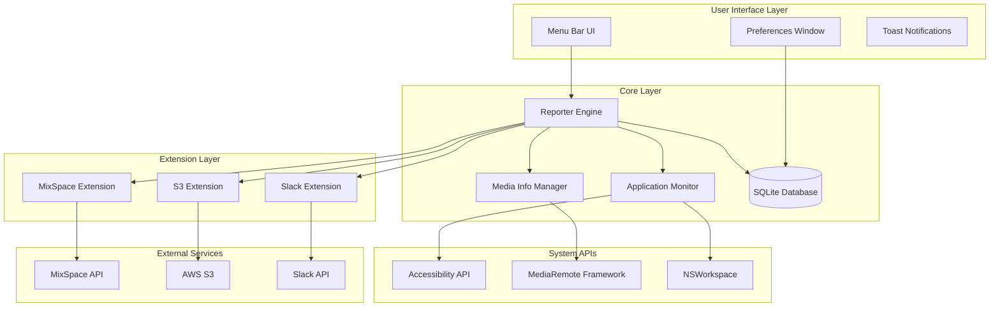
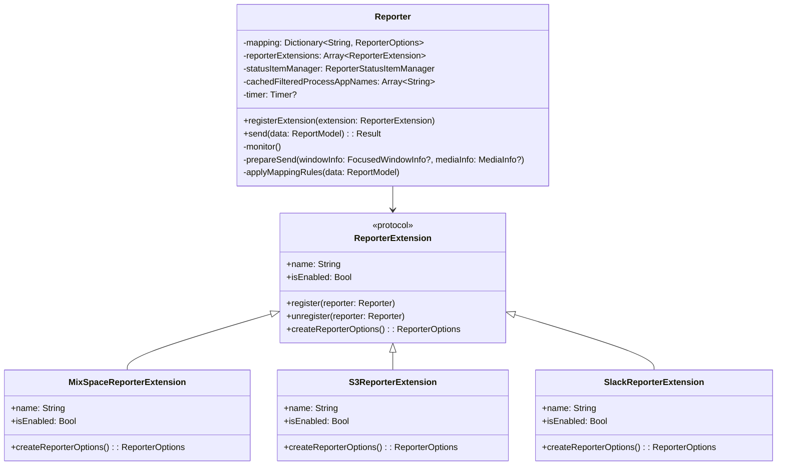
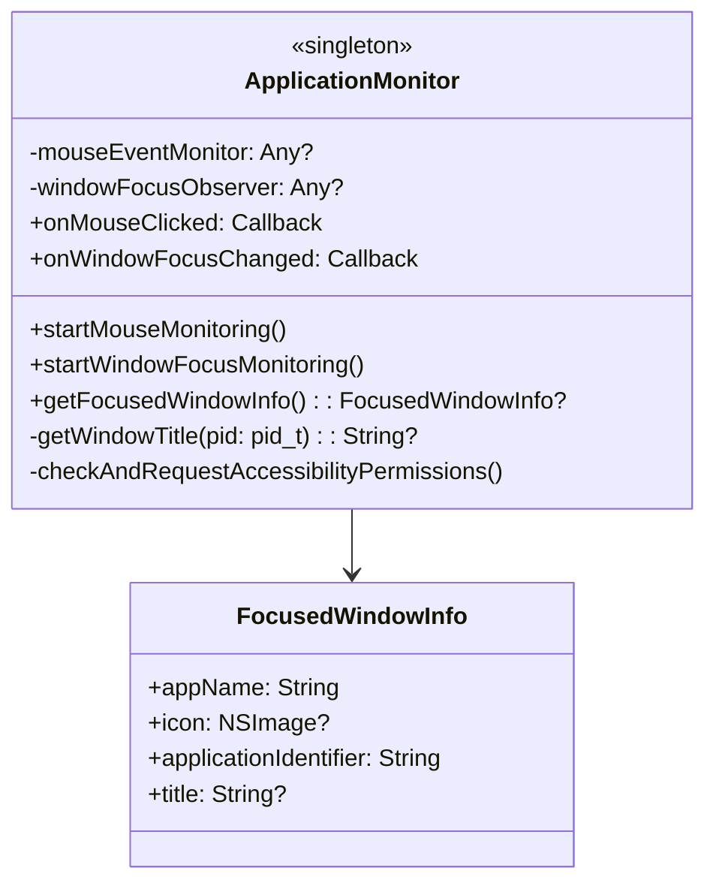
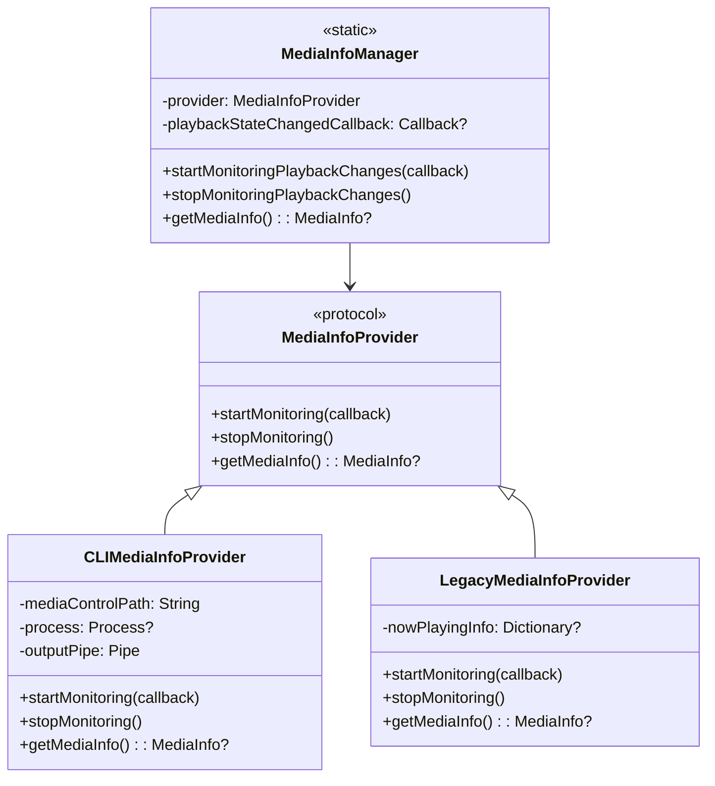
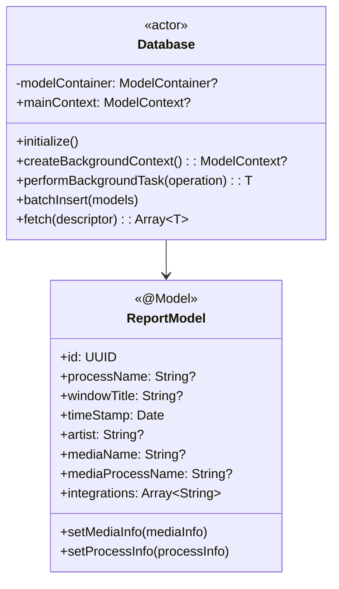
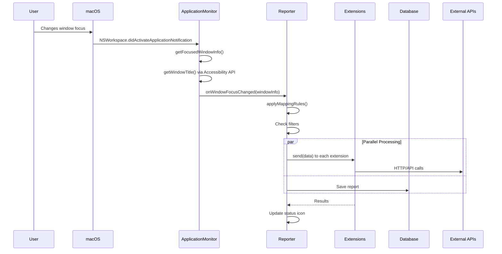
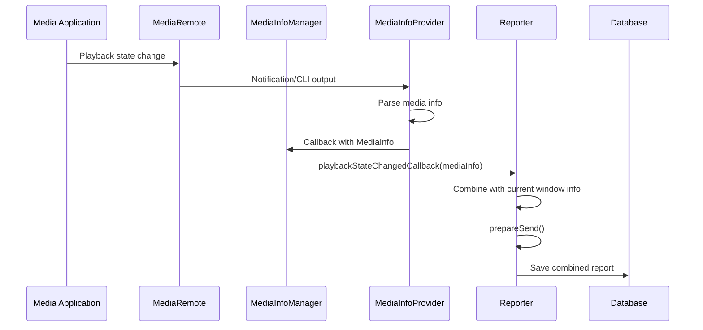
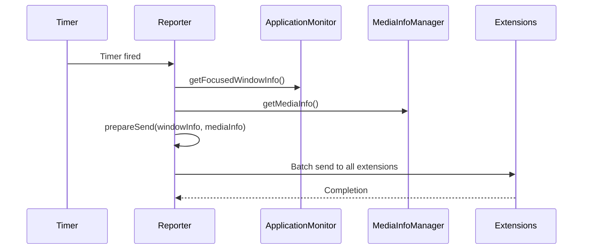

# ProcessReporter Architecture

## Table of Contents
1. [System Architecture Overview](#system-architecture-overview)
2. [Component Architecture](#component-architecture)
3. [Data Flow](#data-flow)
4. [Design Patterns](#design-patterns)
5. [Threading and Concurrency Model](#threading-and-concurrency-model)
6. [Performance Considerations](#performance-considerations)
7. [Security Architecture](#security-architecture)
8. [Technology Choices and Rationale](#technology-choices-and-rationale)

## System Architecture Overview

ProcessReporter is a macOS application built with a modular, event-driven architecture that monitors user activity and reports it to various external services. The application runs as a menu bar utility and leverages macOS system APIs for window tracking and media playback monitoring.

### High-Level Architecture Diagram



## Component Architecture

### 1. Reporter System (`Core/Reporter/`)

The Reporter is the central engine that orchestrates all monitoring and reporting activities.



### 2. Application Monitoring (`Core/Utilities/ApplicationMonitor.swift`)

Monitors focused windows and mouse clicks using macOS Accessibility APIs.



### 3. Media Tracking (`Core/MediaInfoManager/`)

Provides a version-adaptive media tracking system.



### 4. Database Layer (`Core/Database/`)

SwiftData-based persistence layer with actor isolation for thread safety.



## Data Flow

### 1. Window Focus Change Flow



### 2. Media Playback Change Flow



### 3. Periodic Reporting Flow



## Design Patterns

### 1. Extension Architecture Pattern

The reporter uses a plugin-based extension architecture allowing modular integration with external services.

```swift
protocol ReporterExtension {
    var name: String { get }
    var isEnabled: Bool { get }
    func register(to reporter: Reporter) async
    func unregister(from reporter: Reporter) async
    func createReporterOptions() -> ReporterOptions
}
```

**Benefits:**
- Loose coupling between core and integrations
- Easy to add new integrations
- Each extension manages its own lifecycle
- Failures are isolated per extension

### 2. Observer Pattern

Used extensively for reactive programming with RxSwift:

```swift
// Preference changes observation
PreferencesDataModel.shared.isEnabled.subscribe { enabled in
    if enabled {
        self.monitor()
    } else {
        self.dispose()
    }
}
```

### 3. Singleton Pattern

Used for shared managers that need global access:
- `ApplicationMonitor.shared`
- `Database.shared`
- `AppUtility.shared`
- `PreferencesDataModel.shared`

### 4. Strategy Pattern

Media info providers implement different strategies based on macOS version:

```swift
private static var provider: MediaInfoProvider = {
    if #available(macOS 15.4, *) {
        return CLIMediaInfoProvider()
    } else {
        return LegacyMediaInfoProvider()
    }
}()
```

### 5. Actor Pattern

Database uses Swift's actor model for thread-safe operations:

```swift
actor Database {
    func performBackgroundTask<T>(_ operation: @escaping (ModelContext) throws -> T) async throws -> T
}
```

## Threading and Concurrency Model

### 1. Main Actor Usage

UI-related operations and state management run on the main actor:

```swift
@MainActor
class Reporter {
    // All UI updates happen on main thread
}
```

### 2. Concurrent Extension Processing

Extensions process reports concurrently using TaskGroup:

```swift
let results = await withTaskGroup(of: (String, Result<Void, ReporterError>).self) { group in
    for (name, options) in mapping {
        group.addTask {
            let result = await options.onSend(data)
            return (name, result)
        }
    }
    // Collect results...
}
```

### 3. Background Database Operations

Database writes happen on background contexts:

```swift
try await Database.shared.performBackgroundTask { context in
    context.insert(data)
    try context.save()
}
```

### 4. Timer-based Operations

Periodic reporting uses main thread timers:

```swift
Timer.scheduledTimer(withTimeInterval: TimeInterval(interval.rawValue), repeats: true) { _ in
    Task { @MainActor in
        // Report current state
    }
}
```

### 5. Media Monitoring Thread

CLI-based media monitoring runs on a separate thread:

```swift
DispatchQueue.global(qos: .userInteractive).async {
    self.process?.waitUntilExit()
}
```

## Performance Considerations

### 1. Memory Management

**Cache Management:**
- App icon cache cleared during system sleep
- Filtered app names cached to avoid repeated lookups
- Mapping rules cached for performance

```swift
private func cleanupCachesBeforeSleep() {
    AppUtility.shared.clearCache()
    reporter?.clearCaches()
    MediaInfoManager.stopMonitoringPlaybackChanges()
}
```

**Lazy Loading:**
- Icons loaded on-demand
- Database queries paginated
- Transient properties for computed values

### 2. Database Optimization

**Efficient Storage:**
- Binary data storage for images instead of base64
- JSON encoding for array properties
- Unique constraints on IDs

```swift
// Store as Data instead of base64 string
var mediaImageData: Data?

@Transient
var mediaImage: NSImage? {
    get {
        guard let data = mediaImageData else { return nil }
        return NSImage(data: data)
    }
}
```

**Background Operations:**
- All writes happen on background contexts
- Batch operations supported
- Transaction support for consistency

### 3. Network Optimization

**Rate Limiting:**
- Built-in rate limiter for API calls
- Exponential backoff for failures
- Concurrent processing with timeout limits

```swift
enum ReporterError: Error {
    case ratelimitExceeded(message: String)
    // ...
}
```

### 4. Event Handling

**Debouncing:**
- Window focus changes debounced
- Media state changes consolidated
- Timer-based reporting to reduce frequency

**Filtering:**
- System applications ignored
- User-defined filters applied early
- Mapping rules cached and applied efficiently

## Security Architecture

### 1. Permission Model

**Required Permissions:**
- Accessibility API access for window titles
- Full Disk Access for broader monitoring
- Network access for external integrations

```swift
private func checkAndRequestAccessibilityPermissions() {
    let options = [kAXTrustedCheckOptionPrompt.takeUnretainedValue() as String: true]
    let accessibilityEnabled = AXIsProcessTrustedWithOptions(options as CFDictionary)
    // ...
}
```

### 2. Data Protection

**Sensitive Data Handling:**
- Window titles may contain sensitive information
- Credentials stored in UserDefaults (should use Keychain)
- No encryption for database (consideration for improvement)

**Network Security:**
- HTTPS for all external communications
- API keys configurable per integration
- No certificate pinning (potential improvement)

### 3. Privacy Considerations

**User Control:**
- Granular filtering options
- Enable/disable per integration
- Clear data retention policies needed

**Data Minimization:**
- Only necessary data collected
- Configurable reporting intervals
- Local processing where possible

## Technology Choices and Rationale

### 1. Swift and SwiftUI/AppKit

**Rationale:**
- Native macOS development
- Direct access to system APIs
- Modern language features (actors, async/await)
- Type safety and performance

### 2. SwiftData

**Rationale:**
- Native Apple persistence framework
- Automatic migration support
- Type-safe queries
- Integration with Swift concurrency

**Trade-offs:**
- Limited to Apple platforms
- Newer framework with less community support
- Migration complexity

### 3. RxSwift

**Rationale:**
- Reactive programming for UI state
- Well-established pattern
- Good for preference management
- Handles complex event streams

**Trade-offs:**
- Additional dependency
- Learning curve
- Could use Combine instead

### 4. MediaRemote Framework

**Rationale:**
- Official macOS media playback API
- System-wide media information
- No third-party dependencies

**Trade-offs:**
- Private framework (stability concerns)
- Limited documentation
- Version-specific behavior

### 5. Accessibility APIs

**Rationale:**
- Only way to get window titles on macOS
- Official Apple API
- Reliable and maintained

**Trade-offs:**
- Requires user permission
- Privacy implications
- Can be disabled by users

### 6. Menu Bar Architecture

**Rationale:**
- Always accessible
- Minimal UI footprint
- Standard macOS pattern
- Background operation

**Trade-offs:**
- Limited UI space
- No dock presence by default
- Discovery challenges for users

## Future Architecture Considerations

### 1. Enhanced Security
- Keychain integration for credentials
- Certificate pinning for API calls
- Database encryption

### 2. Performance Improvements
- More aggressive caching strategies
- Smarter batching of reports
- Compression for network payloads

### 3. Extensibility
- Plugin system for custom extensions
- JavaScript/Python extension support
- WebSocket support for real-time reporting

### 4. Monitoring Enhancements
- Browser tab tracking
- Terminal command tracking
- File system activity monitoring

### 5. Cross-Platform Considerations
- Abstract platform-specific code
- Consider Electron for wider platform support
- Cloud sync for preferences