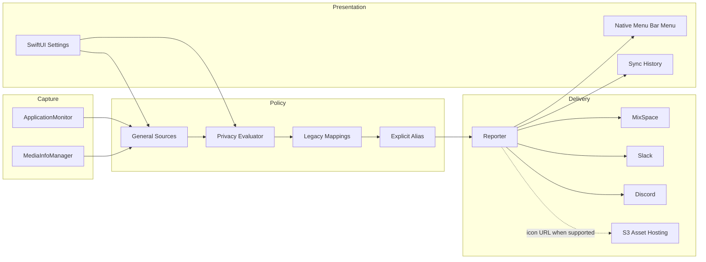
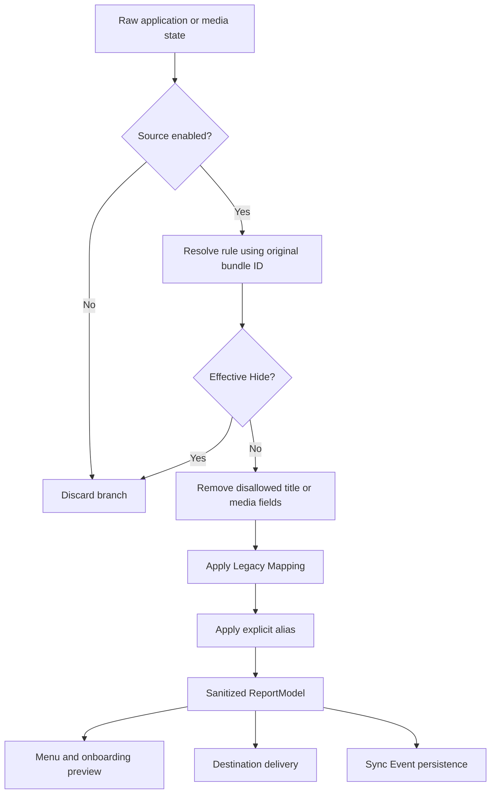
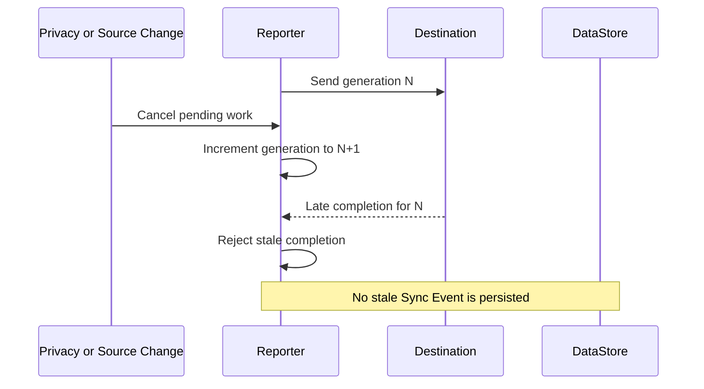
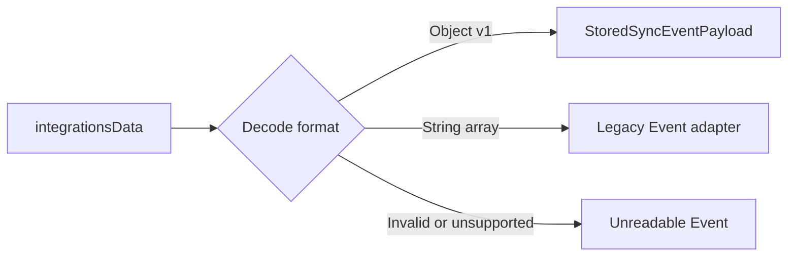

# ProcessReporter Architecture

## Scope and Invariants

ProcessReporter is a macOS menu bar Presence synchronization application. The architecture enforces four product invariants:

1. Only a sanitized current Presence may reach UI preview, destinations, or history.
2. MixSpace, Slack, and Discord are destinations; S3 is optional asset infrastructure.
3. A stale delivery generation must not persist after privacy, source, destination, pause, or sleep changes.
4. Local history is a bounded delivery audit, not a productivity-analysis dataset.

## Runtime Architecture


```mermaid
flowchart LR
  subgraph Capture
    APP["ApplicationMonitor"]
    MEDIA["MediaInfoManager"]
  end

  subgraph Policy
    SOURCES["General Sources"]
    RULES["Privacy Evaluator"]
    MAP["Legacy Mappings"]
    ALIAS["Explicit Alias"]
  end

  subgraph Delivery
    REPORTER["Reporter"]
    MIX["MixSpace"]
    SLACK["Slack"]
    DISCORD["Discord"]
    ASSET["S3 Asset Hosting"]
  end

  subgraph Presentation
    MENU["Native Menu Bar Menu"]
    SETTINGS["SwiftUI Settings"]
    HISTORY["Sync History"]
  end

  APP --> SOURCES
  MEDIA --> SOURCES
  SOURCES --> RULES --> MAP --> ALIAS --> REPORTER
  REPORTER --> MENU
  REPORTER --> MIX
  REPORTER --> SLACK
  REPORTER --> DISCORD
  REPORTER -. "icon URL when supported" .-> ASSET
  REPORTER --> HISTORY
  SETTINGS --> SOURCES
  SETTINGS --> RULES
```

## User Interface Ownership

| Module | Responsibility |
| --- | --- |
| `Features/MenuBar` | Daily Presence status, current sanitized preview, destination results, asset result |
| `Features/Onboarding` | First-run source, destination, optional icon-hosting, and review workflow |
| `Features/Settings/General` | Sharing state, sources, capabilities, startup |
| `Features/Settings/Destinations` | MixSpace, Slack, Discord, and Application Icon Hosting configuration |
| `Features/Settings/PrivacyRules` | Global defaults and application-centered rules |
| `Features/Settings/History` | Native Sync Event list, filters, and Inspector |
| `Features/Settings/Advanced` | Engine controls, compatibility, storage, backup, diagnostics, and destructive maintenance |

The Settings shell is SwiftUI hosted by `SettingWindow`. Destination configuration uses native SwiftUI drafts with explicit test, save, credential intent, and dirty-navigation protection. Only the raw Legacy Mapping editor and cached-icon table remain AppKit compatibility surfaces; legacy Filter, History, and integration forms are not runtime routes.

## Capture and Privacy Pipeline


```mermaid
flowchart TD
  RAW["Raw application or media state"] --> SOURCE{"Source enabled?"}
  SOURCE -->|No| DROP["Discard branch"]
  SOURCE -->|Yes| RULE["Resolve rule using original bundle ID"]
  RULE --> HIDE{"Effective Hide?"}
  HIDE -->|Yes| DROP
  HIDE -->|No| REDACT["Remove disallowed title or media fields"]
  REDACT --> MAPPING["Apply Legacy Mapping"]
  MAPPING --> ALIAS["Apply explicit alias"]
  ALIAS --> SAFE["Sanitized ReportModel"]
  SAFE --> PREVIEW["Menu and onboarding preview"]
  SAFE --> SEND["Destination delivery"]
  SAFE --> STORE["Sync Event persistence"]
```

`ReportModel.sourceProcessApplicationIdentifier` and `sourceMediaApplicationIdentifier` are transient. They preserve original identity for policy lookup and UI deep links when a Legacy Mapping rewrites the provider-facing identifier.

Legacy `filteredProcesses` and `filteredMediaProcesses` remain fail-closed projections. `PresencePrivacyRulesRepository` merges them into effective rules and uses ordered writes so a newly added Hide cannot briefly expose data.

## Reporter Lifecycle and Cancellation

`Reporter` is main-actor isolated because capture callbacks, AppKit state, extension registration, and `ReportModel` are not child-task-safe. Destinations are executed sequentially from a registry snapshot. Asset-independent destinations are ordered before destinations that may request a public icon.

Preparation and delivery each have a generation counter:


```mermaid
sequenceDiagram
  participant Change as Privacy or Source Change
  participant Reporter
  participant Destination
  participant DataStore

  Reporter->>Destination: Send generation N
  Change->>Reporter: Cancel pending work
  Reporter->>Reporter: Increment generation to N+1
  Destination-->>Reporter: Late completion for N
  Reporter->>Reporter: Reject stale completion
  Note over Reporter,DataStore: No stale Sync Event is persisted
```

The generation is checked before and after asset resolution, each destination await, and persistence. `DataStore.saveReport` also checks task cancellation before insertion and before save. If a generation becomes stale immediately after save, its UUID is durably quarantined from History before physical deletion. Failed deletion remains suppressed and is retried on the next launch.

Slack has a serialized delivery queue. Reporting operations can be cancelled without cancelling a required remote clear operation, and Alamofire requests receive task cancellation. Remote clears use bounded retries, retry again after network recovery, and are awaited within the application termination deadline. Discord clears again after a cancelled late SDK completion so an obsolete activity cannot reappear.

When the network is unavailable, Reporter publishes only the sanitized local presentation and records a single “fresh capture required” marker. It does not enqueue or retain a report for replay. Recovery captures current application and media state and executes the complete generation and privacy pipeline again.

Sleep stops monitoring sources, timers, preparation, and delivery. Wake recreates current sources from preferences after the application-level wake delay.

## Destination and Asset Results

Live presentation uses `PresenceDestinationDeliveryResult` and a separate `PresenceAssetResolution`. Aggregate status combines:

- Onboarding and sharing state.
- Network waiting as an internal runtime reason and native menu status item; the visible aggregate remains Degraded or Error according to delivery impact.
- Per-destination sending, success, failure, and skipped state.
- Independent asset degradation.

S3 is represented by `S3AssetHostingService`. It resolves a cached public URL or performs an on-demand upload only when a registered destination declares optional or required public-URL capability. Failed uploads add only the local application identifier and display name to a durable retry queue; credentials and icon data are never persisted there. Maintenance can retry that queue or rebuild current cache records from installed application icons. Discord does not depend on S3 because it uses Discord asset keys.

## Sync Event Persistence

`Database` and `DataStore` are actors and are the only SwiftData boundary. The schema remains:

- `ReportModel` for sanitized Presence scalars and history metadata.
- `IconModel` for cached public application icon URLs.

Modern audit metadata uses a versioned Codable envelope stored in the existing `ReportModel.integrationsData` field:


```mermaid
flowchart LR
  DATA["integrationsData"] --> FORMAT{"Decode format"}
  FORMAT -->|"Object v1"| MODERN["StoredSyncEventPayload"]
  FORMAT -->|"String array"| LEGACY["Legacy Event adapter"]
  FORMAT -->|"Invalid or unsupported"| BAD["Unreadable Event"]
```

This avoids a SwiftData schema migration while preserving old rows. Modern payloads contain only:

- Trigger reason.
- Normalized per-destination state, timestamps, and fixed error code/message.
- A safe output summary derived from the final provider render only when delivery succeeds.
- Asset state and fallback usage without the public URL.

They do not contain raw capture objects, bundle identifiers, credentials, endpoints, request bodies, authorization headers, response bodies, icons, or artwork.

Legacy integration arrays are adapted lazily. Recorded destinations are `Succeeded`; unrecorded current destinations are `Unknown`. A legacy `S3` entry becomes `Legacy Asset Result`. History is capped at 5,000 rows with oldest-first deletion.

## Preferences and Migration

`PresencePreferencesMigrator` uses ordered version steps:

| Version | Migration |
| --- | --- |
| 1 | Distinguish new and existing installations; preserve prior window-title behavior and mark upgrades as onboarded |
| 2 | Create application-centered privacy configuration and merge legacy filters |

Version steps are independent. A version-1 user who later disables Window Titles is not passed through version 1 again during the version-2 migration.

Settings export excludes credentials and retains legacy Filter and Mapping fields for compatibility. Import first validates a complete staged snapshot without mutation. Historical exports containing plaintext credentials then require an explicit restore, omit, or cancel decision. A restore aggregates MixSpace, Slack, and S3 changes into one `CredentialStore` transaction with redacted pending integration preferences; relays are published only after that transaction is durable. Import then pauses reporting, applies the remaining snapshot, reconciles legacy filters, and restores the requested sharing state only if a valid destination and credential authority are available. Truncated integration dictionaries are rejected atomically; legacy backups rebuild application rules from their complete filter snapshot.

## Credential Authority

Destination secrets use `CredentialStore`, backed by Keychain for stable signed builds and a protected local journal when Keychain identity is unavailable. Preference values are redacted. Multi-field changes are coordinated through `SettingsMutationCoordinator` and the credential journal so partial UI updates cannot become the authority. Reset and erase run as exclusive maintenance transactions that close mutation admission until completion.

If the protected journal is unreadable, reporting fails closed. Recovery preserves the unreadable store before any re-entry workflow.

## Advanced Maintenance

`Reset Settings` restores default preference relays while preserving Sync History, icon cache, failed-upload queue, and protected credential values. `Erase All App Data` uses a separate two-confirmation path, pauses sharing and clears runtime secrets before its first suspension, then independently removes protected credentials, Sync History, icon cache, failed-upload queue, and upload fingerprints before restarting onboarding. Runtime state remains fail-closed even when one removal fails. An inaccessible legacy Keychain copy is reported rather than falsely claimed as removed.

Diagnostics are deliberately sanitized. They include version, capability state, counts, destination count, and the latest fixed-code runtime error; they exclude Presence content, endpoints, credentials, and provider responses.

## Verification Boundaries

The primary verification commands are:

```bash
xcodebuild -project ProcessReporter.xcodeproj -scheme ProcessReporter \
  -configuration Debug -destination 'platform=macOS,arch=arm64' \
  CODE_SIGNING_ALLOWED=NO SWIFT_STRICT_CONCURRENCY=complete build

xcodebuild -project ProcessReporter.xcodeproj -scheme ProcessReporter \
  -configuration Debug -destination 'platform=macOS,arch=arm64' \
  CODE_SIGNING_ALLOWED=NO SWIFT_STRICT_CONCURRENCY=complete analyze
```

Runtime and migration smoke tests must use an isolated bundle identifier and isolated Application Support directory. They must not mutate the installed application's preferences, Keychain authority, or production database.
